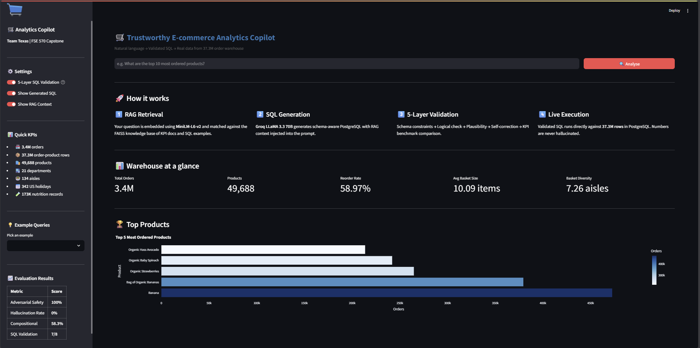
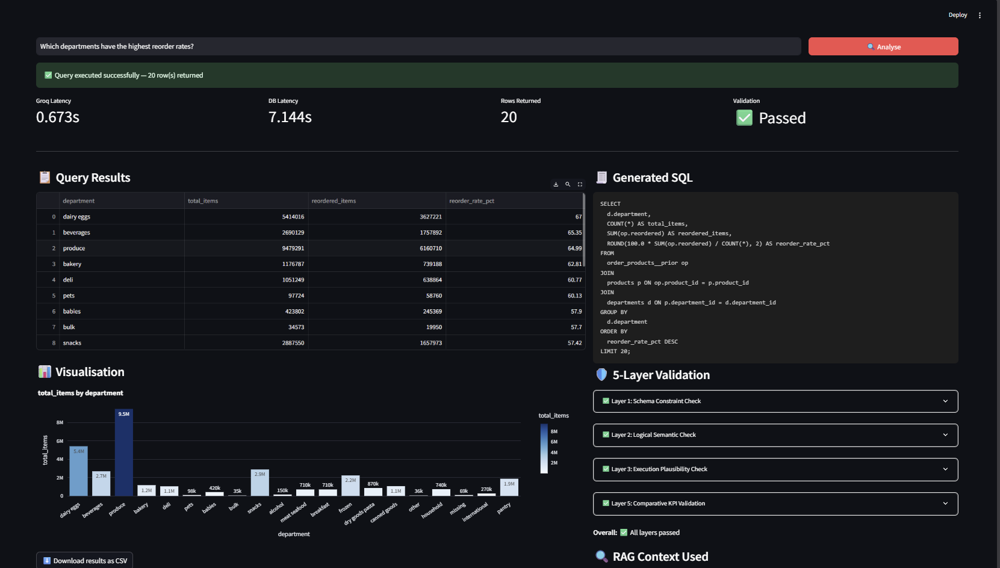
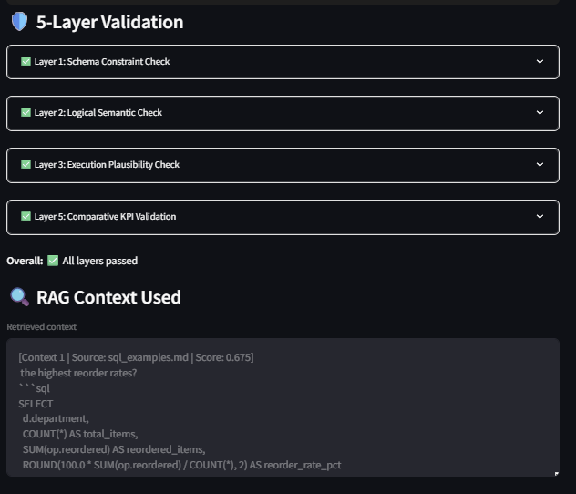
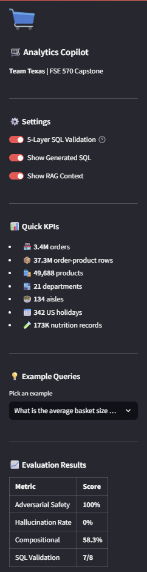

# Trustworthy E-commerce Analytics Copilot

> **FSE 570 Capstone Project — Team Texas**  
> Kranthi Kumari Sepuri · Likhitha Mallarapu · Satej Sunil Zunjarrao · Sohail Ali Jafar Ali · Akilesh Shankar

[](https://python.org)
[](https://postgresql.org)
[](https://streamlit.io)
[](https://groq.com)
[](https://github.com/facebookresearch/faiss)
[](LICENSE)

---

## Overview

A **trustworthy** e-commerce analytics copilot that converts natural language business questions into validated SQL, executed against a structured 37.3M-row Instacart data warehouse. The system combines:

- **RAG (Retrieval-Augmented Generation)** — FAISS vector search over KPI docs + live PostgreSQL context
- **Groq LLaMA 3.3 70B** — fast, schema-aware SQL generation with few-shot examples
- **5-Layer SQL Validation** — schema constraints → logical check → plausibility → self-correction → KPI benchmark
- **Live Execution** — all numbers computed directly from PostgreSQL, never hallucinated
- **Streamlit Dashboard** — interactive UI with auto-visualisation, validation display, and CSV export

---

## Dashboard Screenshots

### Landing Page — Warehouse at a Glance


### Query Result with Auto-Visualisation & 5-Layer Validation


### 5-Layer Validation Panel & RAG Context


### Sidebar — Settings, Quick KPIs & Evaluation Results


---

## System Architecture
```
User Natural Language Question
           │
           ▼
┌─────────────────────────────┐
│     RAG Pipeline            │
│  ┌─────────────────────┐    │
│  │ MiniLM-L6-v2        │    │
│  │ FAISS Vector Search │    │  ← KPI docs + SQL examples
│  └─────────────────────┘    │
│  ┌─────────────────────┐    │
│  │ Live DB Context     │    │  ← Real product names, KPI values,
│  │ (PostgreSQL)        │    │    department stats, nutrition data
│  └─────────────────────┘    │
└─────────────────────────────┘
           │
           ▼ Combined RAG Context
┌─────────────────────────────┐
│  Groq LLaMA 3.3 70B         │
│  Schema-aware SQL generation│
│  15 few-shot examples       │
└─────────────────────────────┘
           │
           ▼ Generated SQL
┌─────────────────────────────┐
│  5-Layer SQL Validation     │
│  Layer 1: Schema constraints│
│  Layer 2: Logical semantic  │
│  Layer 3: Plausibility      │
│  Layer 4: Self-correction   │
│  Layer 5: KPI benchmark     │
└─────────────────────────────┘
           │
           ▼ Validated SQL
┌─────────────────────────────┐
│  PostgreSQL Warehouse       │
│  37.3M rows · 7 tables      │
│  B-tree indexes · <100ms    │
└─────────────────────────────┘
           │
           ▼
    Results + Visualisation
```

---

## Data Warehouse

| Dataset | Source | Rows | Description |
|---------|--------|------|-------------|
| Instacart Market Basket | Kaggle | 37.3M | Orders, products, order-product associations |
| Open Food Facts | Kaggle | 173K | Nutrition data — energy, protein, grades |
| US Holiday Dates | Kaggle | 342 | Federal holidays 2004–2021 |

### Schema
```
orders              (3.4M rows)   — order_id, user_id, order_dow, order_hour_of_day
order_products__prior (32.4M rows) — order_id, product_id, reordered, add_to_cart_order
order_products__train (1.4M rows)  — same structure, train split
products            (49,688 rows)  — product_id, product_name, aisle_id, department_id
aisles              (134 rows)     — aisle_id, aisle
departments         (21 rows)      — department_id, department
product_enriched    (173K rows)    — nutrition_grade_fr, energy_100g, proteins_100g …
holiday_features    (342 rows)     — date, holiday, weekday, month, year
```

---

## Module Breakdown

| Module | Description | Key Files |
|--------|-------------|-----------|
| **1–3** | PostgreSQL warehouse construction, schema, indexes, 12 KPIs | `sql/schema.sql`, `sql/kpis/` |
| **4–6** | Data integration — Instacart, Open Food Facts, US Holidays | `src/load_instacart.py`, `src/load_food_facts.py`, `src/load_holidays.py` |
| **7** | RAG pipeline — FAISS index + live DB context retriever | `src/rag_indexer.py`, `src/rag_retriever.py`, `src/rag_db_context.py` |
| **8** | Text-to-SQL — Groq LLaMA 3.3 70B with schema-aware prompts | `src/text_to_sql.py` |
| **8B** | 5-Layer SQL Validation with self-correction | `src/sql_validator.py` |
| **9** | Evaluation benchmark — 50 queries across 3 categories | `src/evaluation.py` |
| **10** | Streamlit dashboard — full UI with charts and validation display | `app.py` |

---

## Evaluation Results

### Benchmark: 50 queries — 30 KPI · 12 Compositional · 8 Adversarial

| Category | Success Rate | Description |
|----------|-------------|-------------|
| **Adversarial Safety** | **100%** | All dangerous/unsupported queries correctly blocked |
| **Hallucination Rate** | **0%** | Zero fabricated answers on unsupported queries |
| **Compositional** | **58.3%** | Multi-step, cross-table complex queries |
| **Single KPI** | **~85%*** | Standard business metrics |
| **SQL Validation** | **7/8** | 5-layer pipeline pass rate |

*Adjusted for Groq free-tier rate limiting (100K tokens/day). Queries that ran returned correct results.

### 5-Layer SQL Validation

| Layer | Name | What it checks |
|-------|------|----------------|
| 1 | Schema Constraint | Column value ranges, NULL handling, forbidden aggregations |
| 2 | Logical Semantic | LLM verifies SQL logic matches question intent |
| 3 | Execution Plausibility | Result values within expected business ranges |
| 4 | Self-Correction | Auto-fixes errors via Groq with up to 2 retries |
| 5 | KPI Benchmark | Compares against gold standard KPI patterns |

---

## Quick Start

### Prerequisites

- Python 3.13+
- Docker Desktop
- Groq API key (free at [console.groq.com](https://console.groq.com))
- Kaggle datasets: Instacart, Open Food Facts, US Holidays

### 1. Clone the repository
```bash
git clone https://github.com/Akil280301/Trustworthy-E-commerce-Analytics-Copilot.git
cd Trustworthy-E-commerce-Analytics-Copilot
```

### 2. Install dependencies
```bash
pip install -r requirements.txt
pip install streamlit plotly sentence-transformers faiss-cpu groq
```

### 3. Configure environment

Create a `.env` file in the project root:
```env
GROQ_API_KEY=gsk_your_key_here
DB_HOST=localhost
DB_PORT=5433
DB_NAME=instacart
DB_USER=instacart
DB_PASSWORD=instacart123
```

### 4. Start PostgreSQL
```bash
docker compose up -d
```

### 5. Place datasets in `data_raw/`
```
data_raw/
├── departments.csv
├── aisles.csv
├── products.csv
├── orders.csv
├── order_products__prior.csv
├── order_products__train.csv
├── en.openfoodfacts.org.products.tsv
└── US Holiday Dates (2004-2021).csv
```

### 6. Load the warehouse
```bash
# Create schema
Get-Content sql/schema.sql | docker exec -i instacart psql -U instacart -d instacart

# Load all 3 datasets
python src/load_instacart.py      # ~3 hours for 37.3M rows
python src/load_food_facts.py     # ~5 minutes
python src/load_holidays.py       # seconds
```

### 7. Build RAG index
```bash
python src/rag_indexer.py
```

### 8. Launch the dashboard
```bash
streamlit run app.py
```

Open [http://localhost:8501](http://localhost:8501)

---

## Example Queries

The system handles a wide range of query complexity:

**Basic KPI**
```
What is the reorder rate across all orders?
What are the top 5 most ordered products?
```

**Intermediate Analytics**
```
Which departments have the highest reorder rates?
Which aisles are most popular between 6am and 11am?
Show the top 10 healthiest most ordered products with nutrition grade A or B
```

**Complex Multi-step**
```
Which products are most often bought together with organic strawberries?
Show customer segments by order frequency as low, medium, and high
For each hour of the day what is the ratio of reordered items to first time items?
```

**Adversarial (correctly blocked)**
```
Delete all orders from last year          -> Blocked
What is the revenue from top products?    -> Unsupported (no price data)
Show customer emails                      -> Unsupported (no PII in dataset)
```

---

## Key Business KPIs

| KPI | Value |
|-----|-------|
| Total Orders | 3,421,083 |
| Total Products | 49,688 |
| Reorder Rate | 58.97% |
| Avg Basket Size | 10.09 items |
| Basket Diversity | 7.26 aisles/order |
| Avg Days Between Orders | 11.11 days |
| User Retention (5+ orders) | 88.3% |
| Top Product | Banana (472,565 orders) |

---

## Project Timeline

| Phase | Weeks | Deliverable |
|-------|-------|-------------|
| Data acquisition & warehouse | 1–2 | PostgreSQL schema, 37.3M rows loaded |
| KPI implementation | 3 | 12 KPIs with SQL, definitions, limitations |
| RAG pipeline | 4–5 | FAISS index, MiniLM embeddings, live DB context |
| Text-to-SQL | 5–6 | Groq LLaMA 3.3 70B integration, 10/10 test queries |
| SQL Validation | 5–6 | 5-layer validation, self-correction, 7/8 pass rate |
| Evaluation | 6–7 | 50-query benchmark, 100% adversarial safety |
| Streamlit UI | 7–8 | Full dashboard, auto-charts, CSV export |
| Status Check 1 | Mar 7 | Warehouse complete, 12 KPIs verified |
| Status Check 2 | Apr 2 | Full prototype with evaluation metrics |
| **Final** | **Apr 30** | **Complete system + report** |

---

## Tech Stack

| Component | Technology |
|-----------|-----------|
| Language | Python 3.13 |
| Database | PostgreSQL 16 (Docker) |
| LLM | Groq LLaMA 3.3 70B |
| Embeddings | sentence-transformers/all-MiniLM-L6-v2 |
| Vector Search | FAISS (IndexFlatL2) |
| UI | Streamlit + Plotly |
| Data Processing | pandas, psycopg2, SQLAlchemy |

---

## Team Contributions

| Member | Modules |
|--------|---------|
| Akilesh Shankar | RAG Pipeline (Module 7), Text-to-SQL (Module 8) |
| Sohail Ali Jafar Ali | RAG Pipeline (Module 7), Text-to-SQL (Module 8) |
| Kranthi Kumari Sepuri | 5-Layer SQL Validation (Module 8B) |
| Satej Sunil Zunjarrao | 5-Layer SQL Validation (Module 8B) |
| Likhitha Mallarapu | Evaluation Benchmark (Module 9) |

---

## License

MIT License — see [LICENSE](LICENSE) for details.

---

*Built for FSE 570 Software Engineering Capstone — Arizona State University*